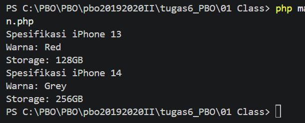

# 1. iPhone - Class dan Object

Dasar PBO: membuat class, object, constructor, dan getter.

## Konsep
- **Class**: cetakan/blueprint objek
- **Object**: hasil `new iPhone(...)` (instantiation)
- **Constructor** (`__construct`): mengisi nilai properti saat objek dibuat
- **Getter**: method untuk membaca nilai properti

## Contoh Output
