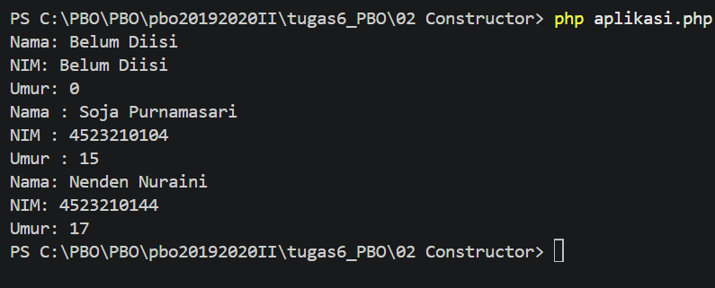

# 2. Mahasiswa - Constructor, Getter, dan Setter

Class `Mahasiswa` dengan properti `private` yang diakses lewat getter dan setter (enkapsulasi).


## Konsep
- **Enkapsulasi**: properti `private`, diakses lewat getter/setter
- **Constructor overloading**: di Java ada 3 constructor, di PHP **tidak ada**, jadi diganti **parameter default**:

```php
new Mahasiswa();                            // semua default
new Mahasiswa("Budi", "12345678");          // umur default 0
new Mahasiswa("Nenden", "4523210144", 17);  // lengkap
```


## Contoh Output



