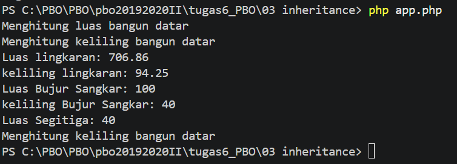
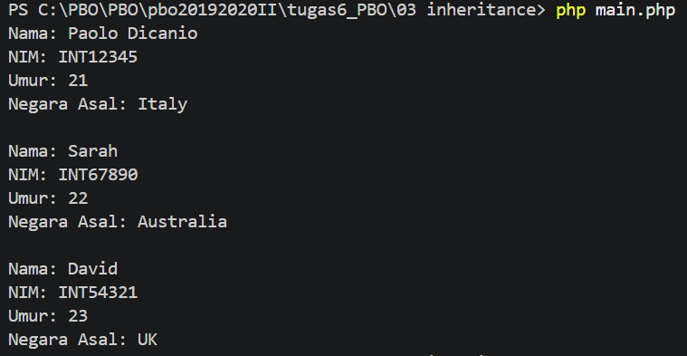

# 3. Bangun Datar  Mahasiswa Internasioanl - Inheritance dan Overriding

Class induk `BangunDatar` diturunkan ke `Lingkaran`, `Persegi`, dan `Segitiga`.

`MahasiswaInternational` mewarisi `Mahasiswa` dan menambah properti `negaraAsal`.

## Konsep Bangun Datar
- **Inheritance**: `class Lingkaran extends BangunDatar`
- **Method overriding**: turunan menulis ulang `luas()` / `keliling()`
- `Segitiga` **tidak** meng-override `keliling()`, sehingga yang terpanggil adalah `keliling()` milik `BangunDatar`

## Konsep Mahasiswa Internasional## Konsep
- `parent::__construct(...)` memanggil constructor class induk (setara `super(...)` di Java)
- `parent::tampilkanInfo()` memanggil method induk di dalam method yang di-override
- **Named argument** (PHP 8+) untuk melewati parameter tertentu:

## Contoh Output Bangun datar

## Contoh Output Bangun datar

