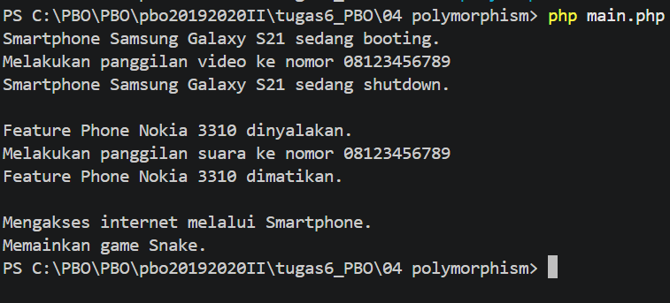

# 4. Polimorfisme Handphone

`Smartphone` dan `FeaturePhone` adalah turunan `Handphone`, tetapi perilakunya berbeda saat method yang sama dipanggil.

## Konsep
- **Polimorfisme**: objek berbeda dimasukkan ke satu array, lalu method yang sama (`nyalakan()`, `telepon()`, `matikan()`) menghasilkan output berbeda
- **`instanceof`**: memeriksa tipe objek sebelum memanggil method khusus (di PHP tidak perlu casting seperti Java)
- Properti `protected` bisa diakses oleh class turunan

## Contoh Output
