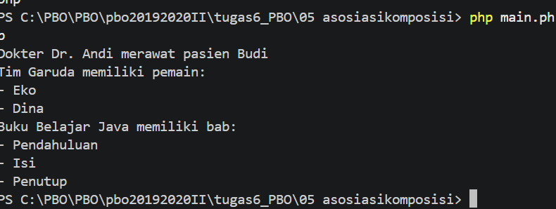

# 5. Relasi Antar Class - Asosiasi, Agregasi, Komposisi

Tiga jenis hubungan antar class dalam PBO.

## File
| File | Peran |
|------|-------|
| `Dokter.php`, `Pasien.php` | Contoh **Asosiasi** |
| `Tim.php`, `Pemain.php` | Contoh **Agregasi** |
| `Buku.php`, `Bab.php` | Contoh **Komposisi** |
| `main.php` | File utama |

## Konsep
| Relasi | Contoh | Penjelasan |
|--------|--------|------------|
| **Asosiasi** | `Dokter` merawat `Pasien` | Dokter memakai objek Pasien lewat parameter method |
| **Agregasi** | `Tim` memiliki `Pemain` | Pemain dibuat di luar lalu dimasukkan ke Tim. Pemain tetap ada walau Tim dihapus |
| **Komposisi** | `Buku` memiliki `Bab` | Bab dibuat di dalam constructor Buku. Jika Buku dihancurkan, Bab ikut hilang |

## Contoh Output

