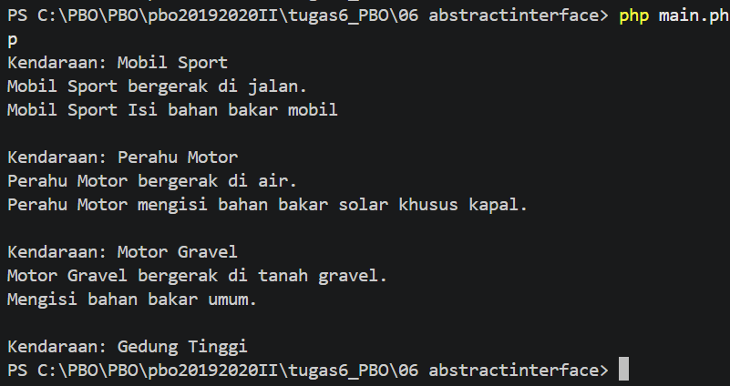

# . Interface dan Abstract Class - Vehicle

Kendaraan dengan kemampuan berbeda: bisa bergerak (`Movable`), butuh bahan bakar (`Fuelable`), atau keduanya tidak.

## Konsep
- **Abstract class**: tidak bisa di-instansiasi langsung, hanya untuk diwariskan
- **Interface**: kontrak method yang wajib diisi class yang meng-implement-nya
- **Trait**: Java punya *default method* di interface, PHP tidak. Penggantinya adalah trait (`use FuelableDefault;`)
- Satu class bisa meng-implement banyak interface, tetapi hanya boleh `extends` satu class

## Contoh Output
